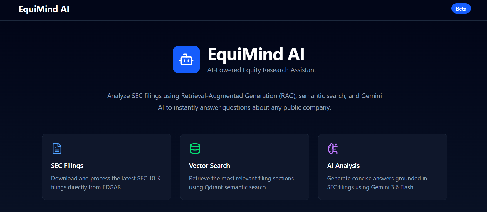
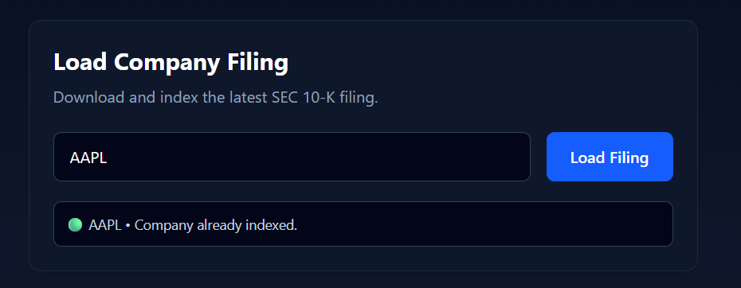
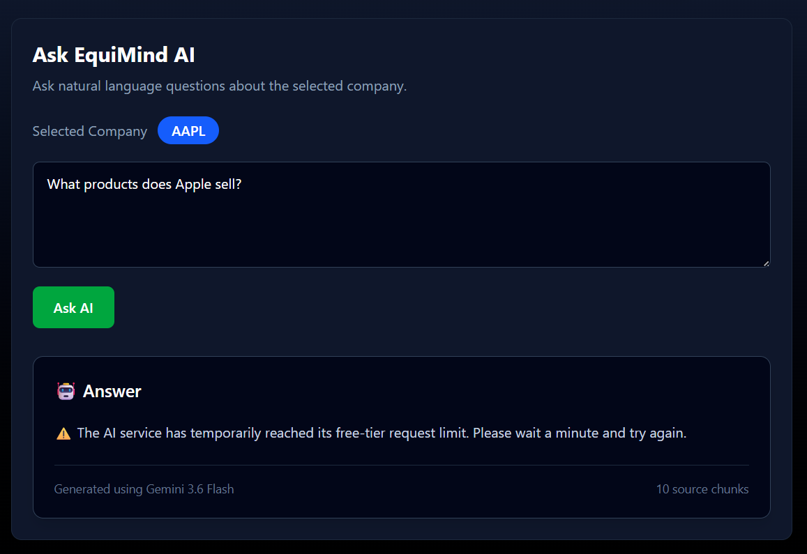

# 📈 EquiMind AI

> **AI-powered Equity Research Platform using Retrieval-Augmented Generation (RAG)**

EquiMind AI is a full-stack AI application that enables users to interact with publicly available SEC 10-K filings through natural language. The platform automatically downloads company filings, processes and indexes them into a vector database, and uses Retrieval-Augmented Generation (RAG) to provide grounded, context-aware answers.

---

## 🚀 Live Demo

🌐 **Frontend:** https://equimind-ai.vercel.app

⚡ **Backend API:** https://equimind-ai.onrender.com

📚 **API Documentation:** https://equimind-ai.onrender.com/docs

---

## ✨ Features

- 📄 Automatically downloads the latest SEC 10-K filings
- 🧹 Cleans and processes raw HTML filings
- ✂️ Splits documents into semantic chunks
- 🧠 Generates embeddings using FastEmbed (BAAI/bge-small-en-v1.5)
- 🔍 Stores and retrieves vectors with Qdrant Cloud
- 🤖 Answers financial questions using Google's Gemini
- 💬 Interactive React-based chat interface
- ☁️ Fully deployed using Vercel, Render, and Qdrant Cloud

---

## 🏗️ System Architecture

```text
                     User
                      │
                      ▼
               React Frontend
                      │
                      ▼
             FastAPI Backend
                      │
      ┌───────────────┴───────────────┐
      ▼                               ▼
 SEC EDGAR API                  Qdrant Cloud
      │                               ▲
      ▼                               │
 HTML Parser → Cleaner → Chunker → FastEmbed
                                      │
                                      ▼
                              Relevant Chunks
                                      │
                                      ▼
                              Gemini 3.6 Flash
                                      │
                                      ▼
                               Final Answer
```

## ⚙️ Tech Stack

| Category | Technologies |
|----------|--------------|
| **Frontend** | React, TypeScript, Vite, Tailwind CSS, Axios |
| **Backend** | FastAPI, Python |
| **AI / RAG** | Google Gemini 3.6 Flash, FastEmbed (BAAI/bge-small-en-v1.5) |
| **Vector Database** | Qdrant Cloud |
| **Data Source** | SEC EDGAR 10-K Filings |
| **Deployment** | Vercel, Render |

## 📂 Project Structure

```text
EquiMindAI/
│
├── backend/
│   ├── app/
│   │   ├── routers/
│   │   ├── services/
│   │   │   ├── embeddings/
│   │   │   ├── llm/
│   │   │   ├── parser/
│   │   │   ├── pipeline/
│   │   │   ├── sec/
│   │   │   └── vector_db/
│   │   ├── config/
│   │   └── main.py
│   │
│   └── requirements/
│
├── frontend/
│   ├── src/
│   │   ├── components/
│   │   ├── pages/
│   │   ├── layouts/
│   │   └── services/
│   │
│   └── package.json
│
└── README.md
```

## 🔄 How EquiMind AI Works

1. The user enters a company's stock ticker (e.g., **AAPL**).
2. The backend downloads the latest SEC 10-K filing from EDGAR.
3. The filing is parsed and cleaned to extract readable text.
4. The document is split into overlapping semantic chunks.
5. FastEmbed converts each chunk into vector embeddings.
6. The embeddings are stored in Qdrant Cloud.
7. When a user asks a question:
   - the question is embedded,
   - the most relevant filing chunks are retrieved from Qdrant,
   - Gemini generates an answer grounded in the retrieved context.


## ✨ Key Features

- AI-powered semantic search over SEC filings
- Retrieval-Augmented Generation (RAG)
- Automatic indexing of SEC 10-K reports
- Fast vector similarity search using Qdrant
- Context-aware financial question answering
- Clean and responsive web interface
- Cloud deployment with Vercel and Render

## 🚀 Getting Started

### 1. Clone the Repository

```bash
git clone https://github.com/Half-Bl00d-Pr1nce/equimind-ai.git
cd equimind-ai
```

---

### 2. Backend Setup

```bash
cd backend

python -m venv venv

# Windows
venv\Scripts\activate

# Linux/macOS
source venv/bin/activate

pip install -r requirements/base.txt
```

Create a `.env` file:

```env
APP_NAME=EquiMind AI
APP_VERSION=1.0.0
API_V1_PREFIX=/api/v1
DEBUG=True

GOOGLE_API_KEY=YOUR_GOOGLE_API_KEY

QDRANT_URL=YOUR_QDRANT_URL
QDRANT_API_KEY=YOUR_QDRANT_API_KEY
```

Run the backend:

```bash
uvicorn app.main:app --reload
```

Backend runs on:

```
http://localhost:8000
```

---

### 3. Frontend Setup

```bash
cd frontend

npm install

npm run dev
```

Frontend runs on:

```
http://localhost:5173
```

## 📡 API Endpoints

| Method | Endpoint | Description |
|--------|----------|-------------|
| GET | `/health` | Health check |
| POST | `/vector/create` | Create Qdrant collection |
| POST | `/vector/index/{ticker}` | Download and index a company's latest 10-K |
| GET | `/vector/search` | Search indexed document chunks |
| GET | `/chat/{ticker}` | Ask questions about a company filing |

## 📸 Screenshots

### Home Page

> 

### Company Indexing

> 

### AI Chat

> 

## 🔮 Future Improvements

- Hybrid Search (Keyword + Vector Search)
- Streaming AI responses
- Conversation history
- Multi-company comparison
- Source citations for every answer
- Financial charts and visualizations
- Authentication and user accounts
- Background indexing jobs for large filings
- Support for 10-Q and 8-K filings

## 👨‍💻 Author

**Sanjay Siddarth S**

- GitHub: https://github.com/Half-Bl00d-Pr1nce
- LinkedIn: *(Add your LinkedIn profile here)*

---

If you found this project helpful, consider giving it a ⭐ on GitHub!

## ⚠️ Known Limitations

- The application is deployed on Render's free tier, which has limited memory. Very large SEC filings may exceed available resources during indexing.
- The AI responses depend on Google's Gemini free-tier API, which is subject to request quotas. If the quota is exceeded, users may need to wait before generating additional responses.
- The system currently indexes one company's filing at a time and does not retain conversation history.

